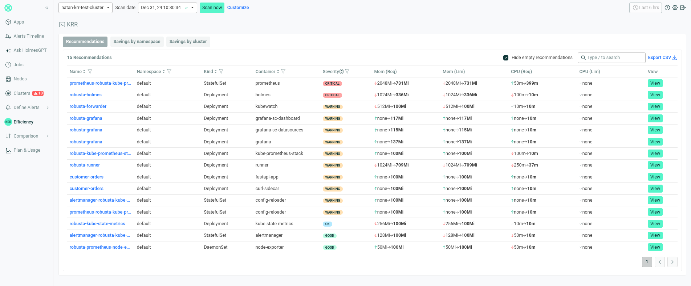
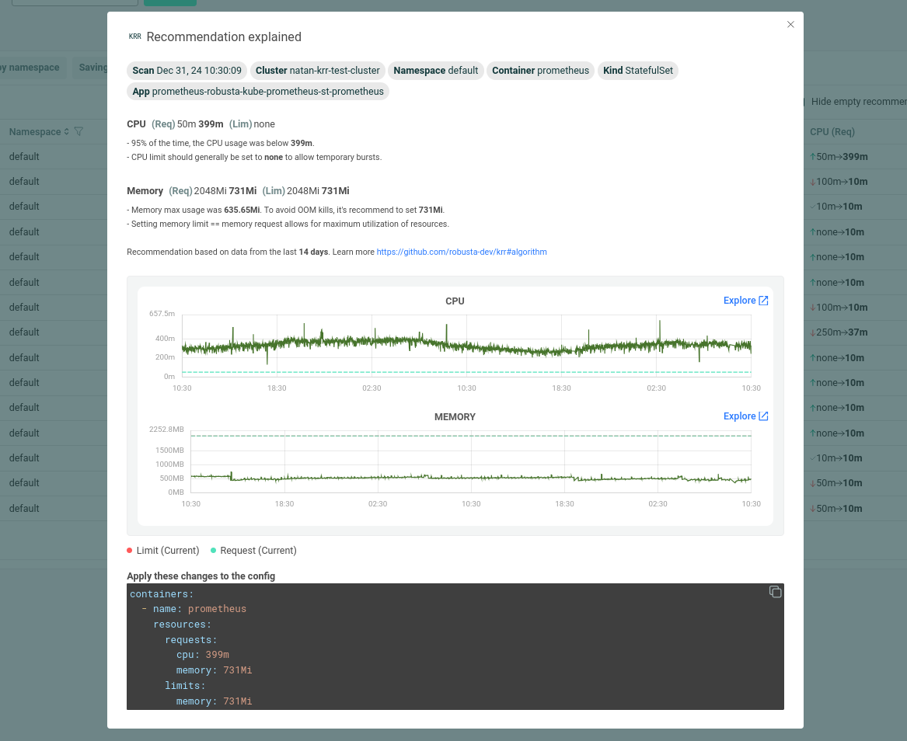

<!-- @format -->

<a name="readme-top"></a>

<!-- [![Contributors][contributors-shield]][contributors-url]
[![Forks][forks-shield]][forks-url]
[![Stargazers][stars-shield]][stars-url]
[![Issues][issues-shield]][issues-url]
[![MIT License][license-shield]][license-url]
[![LinkedIn][linkedin-shield]][linkedin-url] -->

![Product Name Screen Shot][product-screenshot]

<div align="center">
  <h1 align="center">Kubernetes Resource Recommendations Based on Historical Data</h1>
  <h2 align="center">Get recommendations based on your existing data in Prometheus/Coralogix/Thanos/Mimir and more!</h2>
  <p align="center">    
    <a href="#installation"><strong>Installation</strong></a>
    .
    <a href="#how-krr-works"><strong>How KRR works</strong></a>
    .
    <a href="#free-krr-ui-on-robusta-saas"><strong>Free KRR UI</strong></a>
    <br />
    <a href="#usage">Usage</a>
    ·
    <a href="https://github.com/robusta-dev/krr/issues">Report Bug</a>
    ·
    <a href="https://github.com/robusta-dev/krr/issues">Request Feature</a>
    ·
    <a href="#support">Support</a>
    <br />
    <br />
    <a href="https://trendshift.io/repositories/7087" target="_blank"></a>
  </p>
</div>
<!-- TABLE OF CONTENTS -->
<!-- <details>
  <summary>Table of Contents</summary>
  <ol>
    <li>
      <a href="#about-the-project">About The Project</a>
      <ul>
        <li><a href="#built-with">Built With</a></li>
      </ul>
    </li>
    <li>
      <a href="#getting-started">Getting Started</a>
      <ul>
        <li><a href="#prerequisites">Prerequisites</a></li>
        <li><a href="#installation">Installation</a></li>
      </ul>
    </li>
    <li><a href="#usage">Usage</a></li>
    <li><a href="#roadmap">Roadmap</a></li>
    <li><a href="#contributing">Contributing</a></li>
    <li><a href="#license">License</a></li>
    <li><a href="#contact">Contact</a></li>
    <li><a href="#acknowledgments">Acknowledgments</a></li>
  </ol>
</details> -->
<!-- ABOUT THE PROJECT -->

## About The Project

Robusta KRR (Kubernetes Resource Recommender) is a CLI tool for **optimizing resource allocation** in Kubernetes clusters. It gathers pod usage data from Prometheus and **recommends requests and limits** for CPU and memory. This **reduces costs and improves performance**.

### Auto-Apply Mode

**New:** Put right-sizing on auto-pilot by applying recommendations automatically. [Request beta access](https://robusta-dev.typeform.com/krr-auto-apply).

### Data Integrations

[](#data-source-integrations)


_View Instructions for: [Prometheus](#prometheus-victoria-metrics-and-thanos-auto-discovery), [Thanos](#prometheus-victoria-metrics-and-thanos-auto-discovery), [Victoria Metrics](#prometheus-victoria-metrics-and-thanos-auto-discovery), [Google Managed Prometheus](./docs/google-cloud-managed-service-for-prometheus.md), [Amazon Managed Prometheus](#amazon-managed-prometheus), [Azure Managed Prometheus](#azure-managed-prometheus), [Coralogix](#coralogix-managed-prometheus),[Grafana Cloud](#grafana-cloud-managed-prometheus) and [Grafana Mimir](#grafana-mimir-auto-discovery)_


### Reporting Integrations

[](#integrations)

_View instructions for: [Seeing recommendations in a UI](#free-ui-for-krr-recommendations), [Sending recommendations to Slack](#slack-notification), [Setting up KRR as a k9s plugin](#k9s-plugin)_

### Features

- **No Agent Required**: Run a CLI tool on your local machine for immediate results. (Or run in-cluster for weekly [Slack reports](#slack-integration).)
- **Prometheus Integration**: Get recommendations based on the data you already have
- **Explainability**: [Understand how recommendations were calculated with explanation graphs](#free-krr-ui-on-robusta-saas)
- **Extensible Strategies**: Easily create and use your own strategies for calculating resource recommendations.
- **Free SaaS Platform**: See why KRR recommends what it does, by using the [free Robusta SaaS platform](https://platform.robusta.dev/signup/?benefits=krr&utm_source=github&utm_medium=krr-readme&utm_content=features-free-saas-platform).
- **Future Support**: Upcoming versions will support custom resources (e.g. GPUs) and custom metrics.

### How Much Can I Expect to Save with KRR?

According to a recent [Sysdig study](https://sysdig.com/blog/millions-wasted-kubernetes/), on average, Kubernetes clusters have:

- 69% unused CPU
- 18% unused memory

By right-sizing your containers with KRR, you can save an average of 69% on cloud costs.

Read more about [how KRR works](#how-krr-works)

## Difference with Kubernetes VPA

| Feature 🛠️                  | Robusta KRR 🚀                                                                                             | Kubernetes VPA 🌐                                           |
| --------------------------- | ---------------------------------------------------------------------------------------------------------- | ----------------------------------------------------------- |
| Resource Recommendations 💡 | ✅ CPU/Memory requests and limits                                                                          | ✅ CPU/Memory requests and limits                           |
| Installation Location 🌍    | ✅ Not required to be installed inside the cluster, can be used on your own device, connected to a cluster | ❌ Must be installed inside the cluster                     |
| Workload Configuration 🔧   | ✅ No need to configure a VPA object for each workload                                                     | ❌ Requires VPA object configuration for each workload      |
| Immediate Results ⚡         | ✅ Gets results immediately (given Prometheus is running)                                                  | ❌ Requires time to gather data and provide recommendations |
| Reporting 📊                | ✅ Json, CSV, Markdown, [Web UI](#free-ui-for-krr-recommendations), and more!                              | ❌ Not supported                                            |
| Extensibility 🔧            | ✅ Add your own strategies with few lines of Python                                                        | :warning: Limited extensibility                             |
| Explainability 📖           | ✅ [See graphs explaining the recommendations](#free-krr-ui-on-robusta-saas)                               | ❌ Not supported                                            |
| Custom Metrics 📏           | 🔄 Support in future versions                                                                              | ❌ Not supported                                            |
| Custom Resources 🎛️         | 🔄 Support in future versions (e.g., GPU)                                                                  | ❌ Not supported                                            |
| Autoscaling 🔀              | 🔄 Support in future versions                                                                              | ✅ Automatic application of recommendations                 |
| Default History 🕒          | 14 days                                                                                                    | 8 days                                                     |
| Supports HPA 🔥             | ✅ Enable using `--allow-hpa` flag                                                                         | ❌ Not supported                                            |


<!-- GETTING STARTED -->

## Installation

### Requirements

KRR requires Prometheus 2.26+, [kube-state-metrics](https://github.com/kubernetes/kube-state-metrics) & [cAdvisor](https://github.com/google/cadvisor).

<details>
  <summary>Which metrics does KRR need?</summary>
No setup is required if you use kube-prometheus-stack or <a href="https://docs.robusta.dev/master/configuration/alertmanager-integration/embedded-prometheus.html">Robusta's Embedded Prometheus</a>.

If you have a different setup, make sure the following metrics exist:

- `container_cpu_usage_seconds_total`
- `container_memory_working_set_bytes`
- `kube_replicaset_owner`
- `kube_pod_owner`
- `kube_pod_status_phase`

_Note: If one of last three metrics is absent KRR will still work, but it will only consider currently-running pods when calculating recommendations. Historic pods that no longer exist in the cluster will not be taken into consideration._
</details>


### Installation Methods

<details>
  <summary>Brew (Mac/Linux)</summary>

1. Add our tap:

```sh
brew tap robusta-dev/homebrew-krr
```

2. Install KRR:

```sh
brew install krr
```

3. Check that installation was successful:

```sh
krr --help
```

4. Run KRR (first launch might take a little longer):

```sh
krr simple
```
</details>

<details>
  <summary>Windows</summary>

You can install using brew (see above) on [WSL2](https://docs.brew.sh/Homebrew-on-Linux), or install from source (see below).
</details>

<details>
  <summary>Docker image, binaries, and airgapped installation (offline environments)</summary>

You can download pre-built binaries from <a href="https://github.com/robusta-dev/krr/releases">Releases</a> or use the prebuilt Docker container. For example, the container for version 1.8.3 is:

```
us-central1-docker.pkg.dev/genuine-flight-317411/devel/krr:v1.8.3
```

We do **not** recommend installing KRR from source in airgapped environments due to the headache of installing Python dependencies. Use one of the above methods instead and contact us (via Slack, GitHub issues, or email) if you need assistance.
</details>

<details>
  <summary>In-Cluster</summary>

Apart from running KRR as a CLI tool you can also run KRR inside your cluster. We suggest installing KRR via the <a href="https://platform.robusta.dev/signup/?benefits=krr&utm_source=github&utm_medium=krr-readme&utm_content=in-cluster-robusta-platform">Robusta Platform</a>
. It gives you a <a href="https://platform.robusta.dev/signup/?benefits=krr&utm_source=github&utm_medium=krr-readme&utm_content=in-cluster-free-ui">free UI</a> with some features like the following
* View application usage history graphs on which recommendations are based.
* Get application, namespace and cluster level recommendations.
* YAML configuration to apply the suggested recommendation and more





You can also run KRR in-cluster as a Kubernetes Job, if you don't want to view results easily in a <a href="https://platform.robusta.dev/signup/?benefits=krr&utm_source=github&utm_medium=krr-readme&utm_content=in-cluster-ui">UI</a>. 

```
kubectl apply -f https://raw.githubusercontent.com/robusta-dev/krr/refs/heads/main/docs/krr-in-cluster/krr-in-cluster-job.yaml

```
</details>


<details>
  <summary>From Source</summary>

1. Make sure you have [Python 3.9](https://www.python.org/downloads/) (or greater) installed
2. Clone the repo:

```sh
git clone https://github.com/robusta-dev/krr
```

3. Navigate to the project root directory (`cd ./krr`)
4. Install requirements:

```sh
pip install -r requirements.txt
```

5. Run the tool:

```sh
python krr.py --help
```

Notice that using source code requires you to run as a python script, when installing with brew allows to run `krr`.
All above examples show running command as `krr ...`, replace it with `python krr.py ...` if you are using a manual installation.

</details>

### Additional Options

- [View KRR Reports in a Web UI](#free-ui-for-krr-recommendations)
- [Receive KRR Reports Weekly in Slack](#slack-notification)

### Environment-Specific Instructions
Setup KRR for...
- [Google Cloud Managed Prometheus](./docs/google-cloud-managed-service-for-prometheus.md)
- [Azure Managed Prometheus](#azure-managed-prometheus)
- [Amazon Managed Prometheus](#amazon-managed-prometheus)
- [Coralogix Managed Prometheus](#coralogix-managed-prometheus)
- [Grafana Cloud Managed Prometheus](#grafana-cloud-managed-prometheus)
- [Grafana Mimir](#grafana-mimir-auto-discovery)

<p align="right">(<a href="#readme-top">back to top</a>)</p>


**Trusting custom Certificate Authority (CA) certificate:**

If your llm provider url uses a certificate from a custom CA, in order to trust it, base-64 encode the certificate, and store it in an environment variable named ``CERTIFICATE``

## Free KRR UI on Robusta SaaS

We highly recommend using the [free Robusta SaaS platform](https://platform.robusta.dev/signup/?benefits=krr&utm_source=github&utm_medium=krr-readme&utm_content=free-krr-ui-robusta-saas-platform). You can:

- Understand individual app recommendations with app usage history
- Sort and filter recommendations by namespace, priority, and more
- Give devs a YAML snippet to fix the problems KRR finds
- Analyze impact using KRR scan history

  <a href="https://www.loom.com/share/49ea188f67c545f0ae98508b448d1a8b">
      
  </a>

<!-- USAGE EXAMPLES -->


## Usage

<details>
  <summary>Basic usage</summary>

```sh
krr simple
```
</details>

<details>
  <summary>Tweak the recommendation algorithm (strategy)</summary>

Most helpful flags:

- `--cpu-min` Sets the minimum recommended cpu value in millicores
- `--mem-min` Sets the minimum recommended memory value in MB
- `--history_duration` The duration of the Prometheus history data to use (in hours)

More specific information on Strategy Settings can be found using

```sh
krr simple --help
```
</details>

<details>
  <summary>Giving an Explicit Prometheus URL</summary>

If your Prometheus is not auto-connecting, you can use `kubectl port-forward` for manually forwarding Prometheus.

For example, if you have a Prometheus Pod called `kube-prometheus-st-prometheus-0`, then run this command to port-forward it:

```sh
kubectl port-forward pod/kube-prometheus-st-prometheus-0 9090
```

Then, open another terminal and run krr in it, giving an explicit Prometheus url:

```sh
krr simple -p http://127.0.0.1:9090
```
</details>

<details>
  <summary>Run on specific namespaces</summary>

List as many namespaces as you want with `-n` (in this case, `default` and `ingress-nginx`)

```sh
krr simple -n default -n ingress-nginx
```

The -n flag also supports regex matches like -n kube-.*. To use regexes, you must have permissions to list namespaces in the target cluster.

```sh
krr simple -n default -n 'ingress-.*'
```

See [example ServiceAccount and RBAC permissions](./tests/single_namespace_permissions.yaml)
</details>

<details>
  <summary>Run on workloads filtered by label</summary>

Use a <a href="https://kubernetes.io/docs/concepts/overview/working-with-objects/labels/#api">label selector</a>

```sh
python krr.py simple --selector 'app.kubernetes.io/instance in (robusta, ingress-nginx)'
```
</details>

<details>
  <summary>Override the kubectl context</summary>

By default krr will run in the current context. If you want to run it in a different context:

```sh
krr simple -c my-cluster-1 -c my-cluster-2
```

</details>

<details>
  <summary>Output formats for reporting (JSON, YAML, CSV, and more)</summary>

Currently KRR ships with a few formatters to represent the scan data:

- `table` - a pretty CLI table used by default, powered by [Rich](https://github.com/Textualize/rich) library
- `json`
- `yaml`
- `pprint` - data representation from python's pprint library
- `csv` - export data to a csv file in the current directory
- `csv-raw` - csv with raw data for calculation
- `html`

To run a strategy with a selected formatter, add a `-f` flag. Usually this should be combined with `--fileoutput <filename>` to write clean output to file without logs:

```sh
krr simple -f json --fileoutput krr-report.json
```

If you prefer, you can also use `--logtostderr` to get clean formatted output in one file and error logs in another:

```sh
krr simple --logtostderr -f json > result.json 2> logs-and-errors.log
```
</details>

<details>
  <summary>Centralized Prometheus (multi-cluster)</summary>
  <p ><a href="#scanning-with-a-centralized-prometheus">See below on filtering output from a centralized prometheus, so it matches only one cluster</a></p>

</details>

<details>
  <summary>Prometheus Authentication</summary>

KRR supports all known authentication schemes for Prometheus, VictoriaMetrics, Coralogix, and other Prometheus compatible metric stores.

Refer to `krr simple --help`, and look at the flags `--prometheus-url`, `--prometheus-auth-header`, `--prometheus-headers` `--prometheus-ssl-enabled`, `--coralogix-token`, and the various `--eks-*` flags.

If you need help, contact us on Slack, email, or by opening a GitHub issue.
</details>

<details>
  <summary>Debug mode</summary>
If you want to see additional debug logs:

```sh
krr simple -v
```

</details>

<p align="right">(<a href="#readme-top">back to top</a>)</p>

## How KRR works

### Metrics Gathering

Robusta KRR uses the following Prometheus queries to gather usage data:

- CPU Usage:

  ```
  sum(irate(container_cpu_usage_seconds_total{{namespace="{object.namespace}", pod="{pod}", container="{object.container}"}}[{step}]))
  ```

- Memory Usage:

  ```
  sum(container_memory_working_set_bytes{job="kubelet", metrics_path="/metrics/cadvisor", image!="", namespace="{object.namespace}", pod="{pod}", container="{object.container}"})
  ```

[_Need to customize the metrics? Tell us and we'll add support._](https://github.com/robusta-dev/krr/issues/new)

Get a free breakdown of KRR recommendations in the [Robusta SaaS](#free-krr-ui-on-robusta-saas).

### Algorithm

By default, we use a _simple_ strategy to calculate resource recommendations. It is calculated as follows (_The exact numbers can be customized in CLI arguments_):

- For CPU, we set a request at the 95th percentile with no limit. Meaning, in 95% of the cases, your CPU request will be sufficient. For the remaining 5%, we set no limit. This means your pod can burst and use any CPU available on the node - e.g. CPU that other pods requested but aren’t using right now.

- For memory, we take the maximum value over the past week and add a 15% buffer.

### Prometheus connection

Find about how KRR tries to find the default Prometheus to connect <a href="#prometheus-victoria-metrics-and-thanos-auto-discovery">here</a>.

<p align="right">(<a href="#readme-top">back to top</a>)</p>


<!-- ADVANCED USAGE EXAMPLES -->


## Data Source Integrations
<details id="prometheus-victoria-metrics-and-thanos-auto-discovery"><summary> Prometheus, Victoria Metrics and Thanos auto-discovery</summary>

By default, KRR will try to auto-discover the running Prometheus Victoria Metrics and Thanos.
For discovering Prometheus it scans services for those labels:

```python
"app=kube-prometheus-stack-prometheus"
"app=prometheus,component=server"
"app=prometheus-server"
"app=prometheus-operator-prometheus"
"app=rancher-monitoring-prometheus"
"app=prometheus-prometheus"
```

For Thanos its these labels:

```python
"app.kubernetes.io/component=query,app.kubernetes.io/name=thanos",
"app.kubernetes.io/name=thanos-query",
"app=thanos-query",
"app=thanos-querier",
```

And for Victoria Metrics its the following labels:

```python
"app.kubernetes.io/name=vmsingle",
"app.kubernetes.io/name=victoria-metrics-single",
"app.kubernetes.io/name=vmselect",
"app=vmselect",
```

If none of those labels result in finding Prometheus, Victoria Metrics or Thanos, you will get an error and will have to pass the working url explicitly (using the `-p` flag).

<p align="right">(<a href="#readme-top">back to top</a>)</p>

</details>

<details id="scanning-with-a-centralized-prometheus">
<summary>Scanning with a Centralized Prometheus</summary>

If your Prometheus monitors multiple clusters we require the label you defined for your cluster in Prometheus.

For example, if your cluster has the Prometheus label `cluster: "my-cluster-name"`, then run this command:

```sh
krr.py simple --prometheus-label cluster -l my-cluster-name
```

You may also need the `-p` flag to explicitly give Prometheus' URL.

</details>


<details id="azure-managed-prometheus">
<summary>Azure Managed Prometheus</summary>

For Azure managed Prometheus you need to generate an access token, which can be done by running the following command:

```sh
# If you are not logged in to Azure, uncomment out the following line
# az login
AZURE_BEARER=$(az account get-access-token --resource=https://prometheus.monitor.azure.com  --query accessToken --output tsv); echo $AZURE_BEARER
```

Than run the following command with PROMETHEUS_URL substituted for your Azure Managed Prometheus URL:

```sh
python krr.py simple --namespace default -p PROMETHEUS_URL --prometheus-auth-header "Bearer $AZURE_BEARER"
```

<p ><a href="#scanning-with-a-centralized-prometheus">See here about configuring labels for centralized prometheus</a></p>

<p align="right">(<a href="#readme-top">back to top</a>)</p>

</details>

<details id="google-managed-prometheus">
<summary>Google Managed Prometheus (GMP)</summary>

Please find the detailed GMP usage instructions [here](https://github.com/robusta-dev/krr/blob/main/docs/google-cloud-managed-service-for-prometheus.md)

<p align="right">(<a href="#readme-top">back to top</a>)</p>

</details>

<details id="amazon-managed-prometheus">
<summary>Amazon Managed Prometheus</summary>

For Amazon Managed Prometheus you need to add your Prometheus link and the flag --eks-managed-prom and krr will automatically use your aws credentials

```sh
python krr.py simple -p "https://aps-workspaces.REGION.amazonaws.com/workspaces/..." --eks-managed-prom
```

Additional optional parameters are:

```sh
--eks-profile-name PROFILE_NAME_HERE # to specify the profile to use from your config
--eks-access-key ACCESS_KEY # to specify your access key
--eks-secret-key SECRET_KEY # to specify your secret key
--eks-service-name SERVICE_NAME # to use a specific service name in the signature
--eks-managed-prom-region REGION_NAME # to specify the region the Prometheus is in
```

<p ><a href="#scanning-with-a-centralized-prometheus">See here about configuring labels for centralized prometheus</a></p>

<p align="right">(<a href="#readme-top">back to top</a>)</p>
</details>


<details id="coralogix-managed-prometheus">
<summary>Coralogix Managed Prometheus</summary>

For Coralogix managed Prometheus you need to specify your Prometheus link and add the flag coralogix_token with your Logs Query Key

```sh
python krr.py simple -p "https://prom-api.coralogix..." --coralogix_token
```

<p ><a href="#scanning-with-a-centralized-prometheus">See here about configuring labels for centralized prometheus</a></p>

<p align="right">(<a href="#readme-top">back to top</a>)</p>
</details>

<details id="grafana-cloud-managed-prometheus">
<summary>Grafana Cloud Managed Prometheus</summary>

For Grafana Cloud managed Prometheus you need to specify Prometheus link, Prometheus user, and an access token of your Grafana Cloud stack. The Prometheus link and user for the stack can be found on the Grafana Cloud Portal. An access token with a `metrics:read` scope can also be created using Access Policies on the same portal.

Next, run the following command, after setting the values of PROM_URL, PROM_USER, and PROM_TOKEN variables with your Grafana Cloud stack's Prometheus link, Prometheus user, and access token.

```sh
python krr.py simple -p $PROM_URL --prometheus-auth-header "Bearer ${PROM_USER}:${PROM_TOKEN}" --prometheus-ssl-enabled
```

<p ><a href="#scanning-with-a-centralized-prometheus">See here about configuring labels for centralized prometheus</a></p>

<p align="right">(<a href="#readme-top">back to top</a>)</p>

</details>

<details id="grafana-mimir-auto-discovery">
<summary> Grafana Mimir auto-discovery</summary>

By default, KRR will try to auto-discover the running Grafana Mimir.

For discovering Prometheus it scans services for those labels:
```python
  "app.kubernetes.io/name=mimir,app.kubernetes.io/component=query-frontend"
```

<p align="right">(<a href="#readme-top">back to top</a>)</p>

</details>

## Integrations

<details id="free-ui-for-krr-recommendations">
<summary>Free UI for KRR recommendations</summary>

We highly recommend using the [free Robusta SaaS platform](https://platform.robusta.dev/signup/?benefits=krr&utm_source=github&utm_medium=krr-readme&utm_content=integrations-free-robusta-saas-platform). You can:

- Understand individual app recommendations with app usage history
- Sort and filter recommendations by namespace, priority, and more
- Give dev's a YAML snippet to fix the problems KRR finds
- Analyze impact using KRR scan history

  <a href="https://www.loom.com/share/49ea188f67c545f0ae98508b448d1a8b">
      
  </a>

</details>

<details id="slack-notification">
<summary>Slack Notification</summary>

Put cost savings on autopilot. Get notified in Slack about recommendations above X%. Send a weekly global report, or one report per team.

![Slack Screen Shot][slack-screenshot]

### Prerequisites

- A Slack workspace

### Setup

1. [Install Robusta with Helm to your cluster and configure slack](https://docs.robusta.dev/master/installation.html)
2. Create your KRR slack playbook by adding the following to `generated_values.yaml`:

```
customPlaybooks:
# Runs a weekly krr scan on the namespace devs-namespace and sends it to the configured slack channel
customPlaybooks:
- triggers:
  - on_schedule:
      fixed_delay_repeat:
        repeat: -1 # number of times to run or -1 to run forever
        seconds_delay: 604800 # 1 week
  actions:
  - krr_scan:
      args: "--namespace devs-namespace" ## KRR args here
  sinks:
      - "main_slack_sink" # slack sink you want to send the report to here
```

3. Do a Helm upgrade to apply the new values: `helm upgrade robusta robusta/robusta --values=generated_values.yaml --set clusterName=<YOUR_CLUSTER_NAME>`


<p align="right">(<a href="#readme-top">back to top</a>)</p>

</details>

<details id="k9s-plugin">
<summary>k9s Plugin</summary>

  Install our k9s Plugin to get recommendations directly in deployments/daemonsets/statefulsets views.

  Plugin: [resource recommender](https://github.com/derailed/k9s/blob/master/plugins/resource-recommendations.yaml)

  Installation instructions: [k9s docs](https://k9scli.io/topics/plugins/)
</details>

## Creating a Custom Strategy/Formatter

Look into the [examples](https://github.com/robusta-dev/krr/tree/main/examples) directory for examples on how to create a custom strategy/formatter.

<p align="right">(<a href="#readme-top">back to top</a>)</p>

<!-- TESTING -->

## Testing

_We use pytest to run tests._

1. Install the project manually (see above)
2. Navigate to the project root directory
3. Install [poetry](https://python-poetry.org/docs/#installing-with-the-official-installer)
4. Install dev dependencies:

```sh
poetry install --group dev
```

5. Install robusta_krr as editable dependency:

```sh
pip install -e .
```

6. Run the tests:

```sh
poetry run pytest
```

<p align="right">(<a href="#readme-top">back to top</a>)</p>

<!-- CONTRIBUTING -->

## Contributing

Contributions are what make the open source community such an amazing place to learn, inspire, and create. Any contributions you make are **greatly appreciated**.

If you have a suggestion that would make this better, please fork the repo and create a pull request. You can also simply open an issue with the tag "enhancement".
Don't forget to give the project a star! Thanks again!

1. Fork the Project
2. Create your Feature Branch (`git checkout -b feature/AmazingFeature`)
3. Commit your Changes (`git commit -m 'Add some AmazingFeature'`)
4. Push to the Branch (`git push origin feature/AmazingFeature`)
5. Open a Pull Request

<p align="right">(<a href="#readme-top">back to top</a>)</p>

<!-- LICENSE -->

## License

Distributed under the MIT License. See [LICENSE.txt](https://github.com/robusta-dev/krr/blob/main/LICENSE) for more information.

<p align="right">(<a href="#readme-top">back to top</a>)</p>

<!-- CONTACT -->

## Support

If you have any questions, feel free to contact **support@robusta.dev** or message us on [robustacommunity.slack.com](https://bit.ly/robusta-slack)

<p align="right">(<a href="#readme-top">back to top</a>)</p>

<!-- MARKDOWN LINKS & IMAGES -->
<!-- https://www.markdownguide.org/basic-syntax/#reference-style-links -->

[contributors-shield]: https://img.shields.io/github/contributors/othneildrew/Best-README-Template.svg?style=for-the-badge
[contributors-url]: https://github.com/othneildrew/Best-README-Template/graphs/contributors
[forks-shield]: https://img.shields.io/github/forks/othneildrew/Best-README-Template.svg?style=for-the-badge
[forks-url]: https://github.com/othneildrew/Best-README-Template/network/members
[stars-shield]: https://img.shields.io/github/stars/othneildrew/Best-README-Template.svg?style=for-the-badge
[stars-url]: https://github.com/othneildrew/Best-README-Template/stargazers
[issues-shield]: https://img.shields.io/github/issues/othneildrew/Best-README-Template.svg?style=for-the-badge
[issues-url]: https://github.com/othneildrew/Best-README-Template/issues
[license-shield]: https://img.shields.io/github/license/othneildrew/Best-README-Template.svg?style=for-the-badge
[license-url]: https://github.com/othneildrew/Best-README-Template/blob/master/LICENSE.txt
[linkedin-shield]: https://img.shields.io/badge/-LinkedIn-black.svg?style=for-the-badge&logo=linkedin&colorB=555
[linkedin-url]: https://linkedin.com/in/othneildrew
[product-screenshot]: images/screenshot.jpeg
[slack-screenshot]: images/krr_slack_example.png
[ui-screenshot]: images/ui_video.gif
